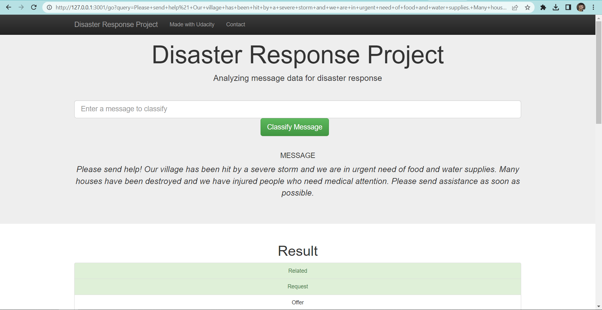
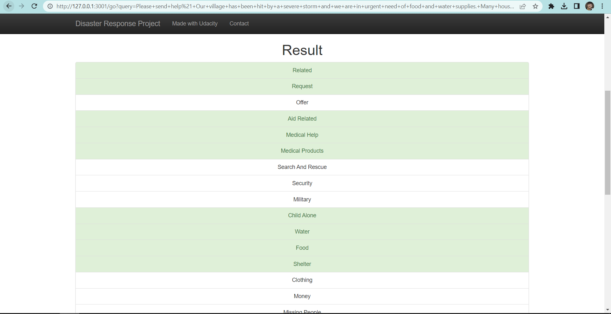
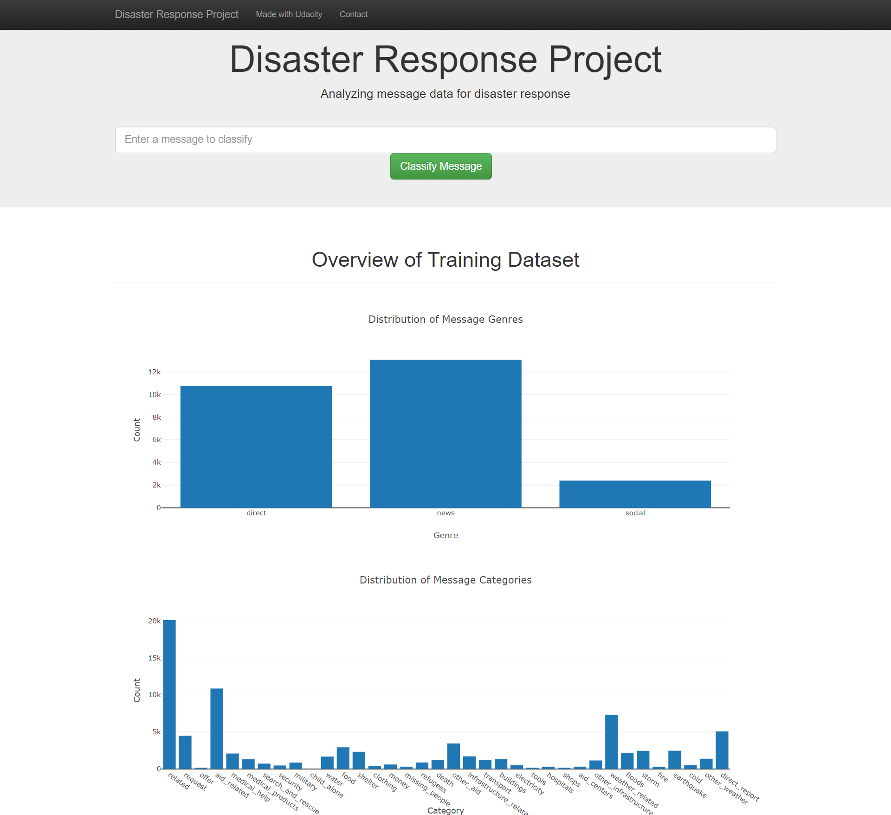
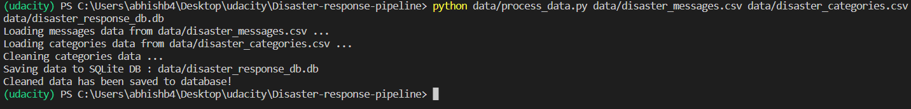
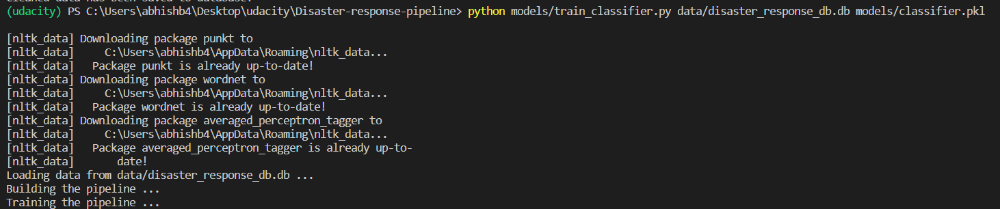
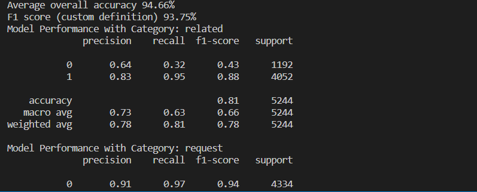

# Disaster Response Pipeline Project (Udacity Data Science Nanodegree)


## Table of Contents
1. [Description](#description)
2. [Getting Started](#getting_started)
	1. [Dependencies](#dependencies)
	2. [Installing](#installation)
	3. [Executing Program](#execution)
	4. [Additional Material](#material)
3. [Acknowledgement](#acknowledgement)
4. [Screenshots](#screenshots)

<a name="descripton"></a>
## Project Overview

The Disaster Response Pipeline Project is a part of the Data Science Nanodegree Program offered by Udacity in collaboration with Figure Eight. The objective of this project is to develop a Natural Language Processing (NLP) model that can accurately categorize messages in real-time, particularly during disasters.

The project is divided into three main sections. Firstly, we extract data from the source, clean and transform it, and store it in a SQLite database using an ETL pipeline. Secondly, we build a machine learning pipeline that trains the model to classify messages into various categories. Lastly, we run a web application that displays the model results in real-time, providing insights into the categorization of new messages as they are received.

<a name="getting_started"></a>
## Getting Started

<a name="dependencies"></a>
### Dependencies
This project requires the following libraries to be installed in your Python environment:

* Python 3.11
* Machine Learning Libraries:
    * NumPy
    * SciPy
    * Pandas
    * Scikit-Learn
* Natural Language Processing Libraries:
    * NLTK
* SQLite Database Libraries:
    * SQLalchemy
* Model Loading and Saving Library:
    * Pickle
* Web App and Data Visualization Libraries:
    * Flask
    * Plotly

<a name="installation"></a>
### Installing
To clone the git repository:
```
https://github.com/Abhi5h3k/Udacity-disaster-response-pipeline.git
```
<a name="execution"></a>
### Executing Program:
1. You can run the following commands in the project's directory to set up the database, train model and save the model.

    - To run ETL pipeline to clean data and store the processed data in the database
        `python data/process_data.py data/disaster_messages.csv data/disaster_categories.csv data/disaster_response_db.db`
    - To run the ML pipeline that loads data from DB, trains classifier and saves the classifier as a pickle file
        `python models/train_classifier.py data/disaster_response_db.db models/classifier.pkl`

2. Run the following command in the app's directory to run your web app.
    `python run.py`

3. Go to http://0.0.0.0:3001/

<a name="material"></a>
### Additional Material

In the **data** and **models** folder you can find two jupyter notebook that will help you understand how the model works step by step:
1. **ETL Preparation Notebook**: learn everything about the implemented ETL pipeline
2. **ML Pipeline Preparation Notebook**: look at the Machine Learning Pipeline developed with NLTK and Scikit-Learn

You can use **ML Pipeline Preparation Notebook** to re-train the model or tune it through a dedicated Grid Search section.

<a name="importantfiles"></a>
### Important Files
**app/templates/***: templates/html files for web app

**data/process_data.py**: Extract Train Load (ETL) pipeline used for data cleaning, feature extraction, and storing data in a SQLite database

**models/train_classifier.py**: A machine learning pipeline that loads data, trains a model, and saves the trained model as a .pkl file for later use

**run.py**: This file can be used to launch the Flask web app used to classify disaster messages


<a name="acknowledgement"></a>
## Acknowledgements

* [Udacity](https://www.udacity.com/) for providing an amazing Data Science Nanodegree Program
* [Figure Eight](https://www.figure-eight.com/) for providing the relevant dataset to train the model

<a name="screenshots"></a>
## Screenshots

1. This is an example of a message we can type to test the performance of the model



2. After clicking **Classify Message**, we can see the categories which the message belongs to highlighted in green



3. The main page shows some graphs about training dataset, provided by Figure Eight



4. Sample run of process_data.py



5. Sample run of train_classifier.py



6. Sample run of train_classifier.py with precision, recall etc. for each category



